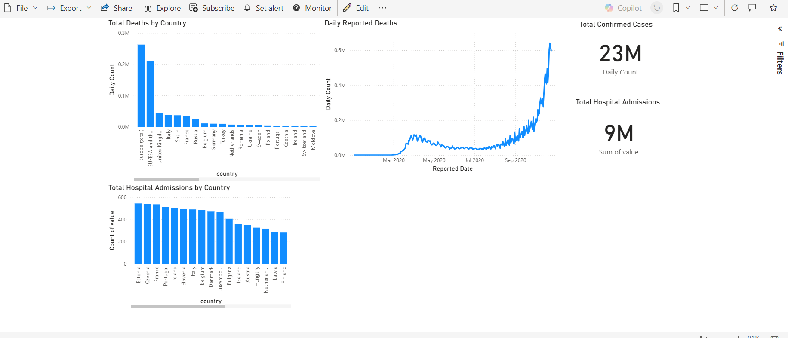

# Building Actionable COVID-19 Insights with Microsoft Fabric

## Problem Statement
Organizations needed a way to rapidly ingest, process, and analyze constantly changing public health data (like COVID-19 statistics from the ECDC) to gain actionable insights for planning and intervention. This project demonstrates a prototype solution built entirely within Microsoft Fabric to address this challenge.

## Solution Overview
This end-to-end data pipeline provides a scalable and efficient architecture to turn complex public health data into reliable, business-focused insights. The solution leverages the integrated capabilities of Microsoft Fabric for ingestion, transformation, storage, modeling, and visualization.

## Architecture & Workflow
The pipeline follows a modern data engineering workflow within the Fabric ecosystem:

1.  **Ingestion:** Fabric **Data Pipelines** (using Copy Data activity) pull raw CSV data directly from web sources into a **Fabric Lakehouse** (Files section).
2.  **Transformation:** **Dataflows Gen2** (Power Query) clean, join (enriching with lookup data), filter, and reshape the raw datasets, applying necessary business logic.
3.  **Storage & Modeling:** The processed, analysis-ready data is stored as optimized Delta tables in the **Fabric Lakehouse** (Tables section). A **Semantic Model** is built on top of these tables to define relationships and prepare for reporting.
4.  **Visualization:** **Power BI** connects to the Semantic Model using **Direct Lake** mode, enabling high-performance, real-time reporting and interactive dashboards.
5.  **Orchestration:** A master **Data Pipeline** automates the entire workflow, managing dependencies and ensuring reliable execution.

## Technologies Used
* **Platform:** Microsoft Fabric
* **Orchestration:** Fabric Data Pipelines
* **Ingestion:** Fabric Data Pipelines (Copy Data activity, Web connector)
* **Storage:** Fabric Lakehouse (Files and Tables/Delta Lake)
* **Transformation:** Fabric Dataflows Gen2 (Power Query Online)
* **Modeling:** Fabric Semantic Model
* **BI & Visualization:** Power BI (connected via Direct Lake)

## Final Output: Actionable Dashboard
The final result is an interactive Power BI dashboard providing key insights into COVID-19 trends, including cases, deaths, and hospital admissions across different countries and over time.

## Business Value & Key Learnings
This project demonstrates how Microsoft Fabric can be used to:
* Rapidly build end-to-end data pipelines for complex datasets.
* Integrate data ingestion, transformation, and visualization seamlessly.
* Leverage Direct Lake mode for high-performance Power BI reporting directly on the Lakehouse.
* Provide a scalable foundation for turning raw data into actionable insights that support informed decision-making.
* Successfully troubleshoot and debug authentication, data format, and pipeline orchestration issues in a cloud environment.
